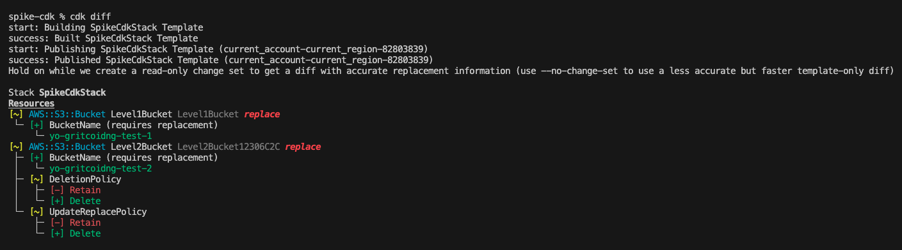

# AWS CDK TypeScript Project

A guide to getting started with AWS Cloud Development Kit (CDK) using TypeScript.

## Prerequisites

Before starting, ensure you have the following installed:

- [Node.js](https://nodejs.org/)
- [TypeScript](https://www.typescriptlang.org/)
- [AWS CLI](https://aws.amazon.com/cli/)

## Installation

### 1. Install AWS CDK globally

```bash
npm i -g aws-cdk
```

### 2. Verify installation

```bash
cdk --version
```

## Setup

### 1. Configure AWS CLI

Ensure your AWS CLI is configured with your credentials:

```bash
aws configure
```

### 2. Initialize a new CDK project

Navigate to an empty directory and run:

```bash
cdk init app --language typescript
```

This will create a new CDK project with the necessary TypeScript configuration and boilerplate code.

### 3. Bootstrap your AWS environment

Run this command only once per AWS account/region:

```bash
cdk bootstrap
```

This creates the necessary AWS resources (S3 bucket, IAM roles) for CDK deployments.

> 💡 **Learn more**: See [cdk-bootstrap-explained.md](cdk-bootstrap-explained.md) for a detailed explanation of what bootstrap creates and how the CDK asset bucket works.

## Development Workflow

### 1. Add resources to your stack

Edit the stack file in the `lib/` directory to define your AWS infrastructure resources.

### 2. Synthesize CloudFormation template

Generate the CloudFormation template from your CDK code:

```bash
cdk synth
```

This validates your code and outputs the generated CloudFormation template.

### 3. Compare changes (optional)

See what changes will be deployed:

```bash
cdk diff
```


*Example of `cdk diff` showing changes between local code and deployed stack*

### 4. Deploy your stack

Deploy your infrastructure to AWS:

```bash
cdk deploy
```

## CDK Bootstrap Resources

After running `cdk bootstrap`, you can view the created resources in the AWS CloudFormation console

## Useful Commands

- `cdk synth` - Synthesize the CloudFormation template
- `cdk deploy` - Deploy the stack to AWS
- `cdk diff` - Compare deployed stack with current state
- `cdk destroy` - Remove the stack from AWS
- `npm run build` - Compile TypeScript to JavaScript
- `npm run watch` - Watch for changes and compile
- `npm run test` - Run unit tests

## Project Structure

```
.
├── bin/           # CDK app entry point
├── lib/           # Stack definitions
├── test/          # Unit tests
├── cdk.json       # CDK configuration
└── tsconfig.json  # TypeScript configuration
```

## Additional Documentation

### Core Concepts
- **[CDK Bootstrap Explained](cdk-bootstrap-explained.md)** - Deep dive into what `cdk bootstrap` creates, how the asset bucket works, and managing bootstrap resources
- **[CDK State Management](CDK-STATE-MANAGEMENT.md)** - Understanding how CDK tracks infrastructure state, handling concurrent deployments, and differences from Terraform

### Key Takeaways
- **Bootstrap is per account/region**: You only need to run `cdk bootstrap` once per AWS account and region combination
- **State is in AWS**: Unlike Terraform, CDK doesn't use local state files - CloudFormation in AWS is the source of truth
- **Shared resources**: All CDK projects in the same account/region share the same bootstrap bucket and resources

## Next Steps

- Explore the [AWS CDK documentation](https://docs.aws.amazon.com/cdk/)
- Check out [CDK Patterns](https://cdkpatterns.com/)
- Review [AWS Construct Library](https://docs.aws.amazon.com/cdk/api/v2/docs/aws-construct-library.html)
